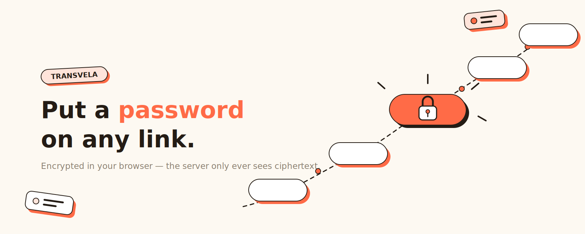

# Transvela

[中文](./README.md) | **English**



**Put a password on any link, then share it.**

Transvela turns any URL into a short link that asks for a password before redirecting to the original address. Great for sharing cloud-drive files, internal docs, meeting links, hidden easter eggs — any time the link may get forwarded, but the content is meant only for people who know the secret.

👉 Try it now: <https://transvela.ffutop.com>

## Create a protected link in three steps

1. Open [transvela.ffutop.com](https://transvela.ffutop.com) and paste the link you want to protect
2. Set a password, and optionally add a hint (e.g. "the city where we first met")
3. Copy the generated short link and send it

When someone opens the short link and enters the correct password, they are redirected to the original address; a wrong password shows the hint you left. The interface is available in English and Chinese.

## Are my links and passwords safe?

**Yes — because we never get to see them.**

- Encryption and decryption happen **entirely in your browser**. By the time you hit "Create", the original URL is already encrypted with your password; only ciphertext is sent to the server.
- The server stores **neither the original URL nor the password**, and has no way to decrypt anything. Even a full database leak would yield nothing but gibberish to anyone without the password.
- Visitors decrypt in their own browser too. Whether a password is right or wrong, the server never knows and never touches it.
- Under the hood: the password is run through PBKDF2 (SHA-256, 150,000 iterations) to derive an AES-256-GCM key; if the ciphertext is tampered with or the password is wrong, decryption simply fails.

The code is fully open source — audit it yourself, or [run your own instance](#development--self-hosting). Privacy policy [here](https://transvela.ffutop.com/privacy.html).

The flip side: **don't lose your password**. If it's gone, we cannot recover the original link for you.

## Browser extension

Don't want to open the website every time? Install the extension (works on Chrome / Edge / Brave) and create links on the spot:

- Click the Transvela toolbar icon — the current page's URL is pre-filled
- Right-click any link on a page → **"Protect this link with Transvela"**

Encryption in the extension is just as local. It is currently distributed as an unpacked extension:

1. Download this repository and open `chrome://extensions`
2. Enable "Developer mode" in the top-right corner
3. Click "Load unpacked" and select the `extension/` directory

## Use it from an AI coding agent

This repository doubles as a plugin marketplace containing the `transvela-link` skill, which lets an agent create or unlock protected links for you. Encryption runs through local Node scripts (Node.js 18+ required) — **your password and original URL never leave your machine**.

Install in Claude Code:

```
/plugin marketplace add ffutop/transvela
/plugin install transvela@transvela
```

Once installed, just tell the agent "protect this link for me" — it will ask you for the password, then hand back the short link. Unlocking works the same way.

Prefer not to install a plugin? Clone the repo and run the scripts directly:

```bash
node skills/transvela-link/scripts/create.mjs <url> <password> [hint]   # create
node skills/transvela-link/scripts/open.mjs <code-or-url> <password>    # unlock
```

The repo also ships plugin descriptors for Codex (`.codex-plugin/`), Cursor (`.cursor-plugin/`), and Gemini (`gemini-extension.json`), loadable through each agent's own plugin mechanism.

## FAQ

**I forgot the password. Can it be recovered?**
No. The server holds neither your password nor the original link — that's the price of privacy. Leave a hint only the recipient would understand when you create the link.

**Do links expire? Is there a view limit?**
Not currently — links don't expire and views are unlimited. Expiration, view limits, and access stats are on the roadmap.

**Is it free?**
All current features are free to use.

**Can the password be brute-forced?**
Key derivation uses 150,000 rounds of PBKDF2, which makes guessing passwords one by one expensive; still, a long, hard-to-guess password remains your best protection. Rate-limiting protections (e.g. CAPTCHA) are on the roadmap.

## Development & self-hosting

Transvela is built on Cloudflare Pages + D1; the entire backend is two stateless APIs (store ciphertext, fetch ciphertext). Local development needs no Cloudflare account:

```bash
npm install
npm run db:migrate:local   # first run: initialize the local database
npm run dev                # http://localhost:8788
```

To deploy your own instance: log in to your Cloudflare account (`npx wrangler login`), create a D1 database (`npx wrangler d1 create transvela-db`, then put the `database_id` into `wrangler.toml`), run `npm run db:migrate:remote` to create the tables, and finish with `npm run deploy`.

Note for contributors: the single source of truth for the crypto (`crypto.js`) and bilingual copy (`i18n.js`) lives in `shared/`; after editing, run `npm run sync:shared` to propagate to the web pages and the extension. 