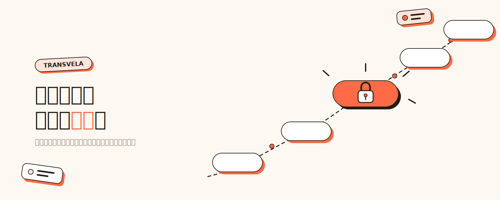

# Transvela

**中文** | [English](./README.en.md)



**给任何链接加一道密码，再分享出去。**

Transvela 把任意链接变成一个短链接，打开它的人必须输入正确的密码才能跳转到原始地址。适合分享网盘文件、内部文档、会议链接、隐藏彩蛋——任何“链接可以转发，但内容只想给知道暗号的人看”的场景。

👉 立即使用：<https://transvela.ffutop.com>

## 三步创建一个加密链接

1. 打开 [transvela.ffutop.com](https://transvela.ffutop.com)，粘贴你想保护的链接
2. 设置一个密码，可以顺手写一句密码提示（比如“我们第一次见面的城市”）
3. 复制生成的短链接，发给对方

对方打开短链接后输入密码，即可跳转到原始地址；输错了会看到你留的提示。界面支持中英双语。

## 你的链接和密码安全吗？

**是的——因为我们根本拿不到它们。**

- 加密和解密**只在你的浏览器里完成**。你点“创建”时，原始链接已经用你的密码加密好了，发到服务器的只有一段密文。
- 服务器**不存原始链接、不存密码**，也没有能力解密。就算数据库整个泄露，没有密码的人拿到的也只是乱码。
- 访问者输入密码后，同样是在 TA 自己的浏览器里解密。密码对不对，服务器无从知晓，也从不经手。
- 技术上：密码经 PBKDF2（SHA-256，150,000 轮）派生出 AES-256-GCM 密钥；密文一旦被篡改或密码不对，解密会直接失败。

代码完全开源，你可以亲自核验，也可以[自己部署一套](#开发与自部署)。隐私政策见[这里](https://transvela.ffutop.com/privacy.html)。

正因为如此，**请务必记好密码**：密码丢了，我们也无法帮你找回原始链接。

## 浏览器插件

不想每次都打开网站？装上插件（Chrome / Edge / Brave 均可用），两种方式随手创建：

- 点击工具栏的 Transvela 图标，自动预填当前页面的链接
- 在网页里的任意链接上右键 → **“用 Transvela 保护此链接”**

插件里的加解密同样只在本地进行。目前处于本地加载阶段，安装方式：

1. 下载本仓库，打开 `chrome://extensions`
2. 右上角开启“开发者模式”
3. 点击“加载已解压的扩展程序”，选择仓库中的 `extension/` 目录

## 在 AI 编码代理里使用

本仓库同时是一个插件市场，内含 `transvela-link` 技能：让代理帮你创建或解开加密链接。加解密通过本地 Node 脚本完成（需 Node.js 18+），**密码和原始链接同样不出你的电脑**。

在 Claude Code 中安装：

```
/plugin marketplace add ffutop/transvela
/plugin install transvela@transvela
```

安装后直接对代理说“帮我把这个链接加密”，代理会先向你确认密码，再返回生成的短链接；解开链接同理。

不想装插件的话，也可以克隆仓库后手动运行脚本：

```bash
node skills/transvela-link/scripts/create.mjs <链接> <密码> [提示]   # 创建
node skills/transvela-link/scripts/open.mjs <短码或短链> <密码>      # 解开
```

仓库还附带 Codex（`.codex-plugin/`）、Cursor（`.cursor-plugin/`）与 Gemini（`gemini-extension.json`）的插件描述文件，可按各自代理的插件机制加载。

## 常见问题

**忘记密码怎么办？**
无法找回。服务器没有你的密码和原始链接，这是隐私保护的代价。建议创建时留一句只有对方看得懂的提示。

**链接会过期吗？有访问次数限制吗？**
目前不会过期、不限次数。链接有效期、访问次数限制、访问统计等功能在规划中。

**收费吗？**
当前所有功能免费使用。

**密码会被暴力破解吗？**
密钥派生使用了 15 万轮 PBKDF2，大幅提高了逐个试密码的成本；但一个足够长、不易猜的密码仍是最好的保护。针对高频试错的防护（如人机验证）在规划中。

## 开发与自部署

Transvela 构建在 Cloudflare Pages + D1 上，整个后端只有两个无状态 API（存密文、取密文）。本地开发不需要 Cloudflare 账号：

```bash
npm install
npm run db:migrate:local   # 首次:初始化本地数据库
npm run dev                # http://localhost:8788
```

想部署一套自己的实例：登录你的 Cloudflare 账号（`npx wrangler login`），创建 D1 数据库（`npx wrangler d1 create transvela-db`，把 `database_id` 填入 `wrangler.toml`），执行 `npm run db:migrate:remote` 建表，再 `npm run deploy` 即可。

给贡献者的注意事项：加解密（`crypto.js`）与双语文案（`i18n.js`）的唯一源头在 `shared/`，改动后运行 `npm run sync:shared` 同步到网页与插件。
